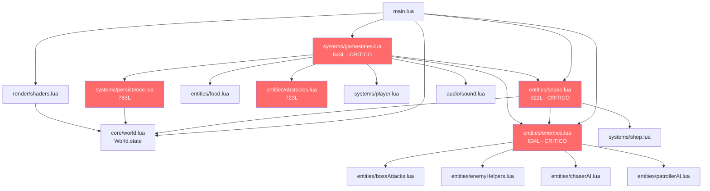
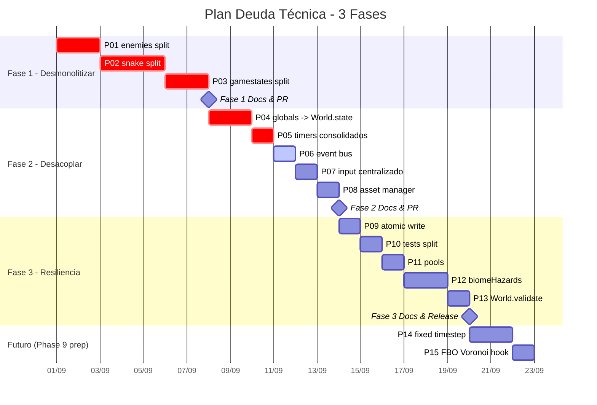
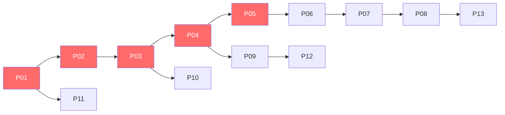

# Plan de Saneamiento de Deuda Técnica — Snake Dungeon Crawler

**Versión:** 2.0 — Cierre ✅ Completed (2026-09-04 America/Bogota)
**Fecha plan:** 2026-08-31 23:04 (America/Bogota) — **Cierre:** 2026-09-04 16:00 (America/Bogota)
**Rama base:** `main` @ `87d5ac4` — Rama de plan: `chore/tech-debt-plan` (mergeada) — Ejecución: `dev` @ `8691a29` (PRs #9 #10 #11 #12 #13)
**Autor:** Chibi-chan / Equipo Técnico — Skill `documentation` + `git-workflow` + `technical-partner`
**Estado:** `completed` — P01-P15 cerradas, Fase 1 M1 ✅, Fase 2 M2 ✅, Fase 3 M3 ✅, Futuro P14-P15 ✅

---

## 1. Resumen Ejecutivo

Este plan formaliza el saneamiento de la deuda técnica viva detectada tras la Fase 8 (Biomas + Patroller Tactical AI + Guillotine Slice). La auditoría en vivo del 2026-08-31 identificó **5 módulos por encima del límite 300–500 líneas**, doble sistema de timers, estado mutable disperso (`shop.shieldActive`, `enemies.list`) y tres carencias de infraestructura (sin event bus, sin asset manager, escritura no atómica de `profiles.dat`). El objetivo es dejar el proyecto en **estado cero-deuda estructural** en tres sprints incrementales, manteniendo en todo momento el invariante `love .` funcional y `error.log` en 0 bytes, para desbloquear sin fricción los bloques de Phase 8 pendientes (Items 51–60, Mini-Bosses, Boss Enrage/Laser) y Phase 9 (100 propuestas visuales).

**Alcance del plan:** 15 propuestas priorizadas (5 CRÍTICO, 5 RECOMENDADO, 3 OPCIONAL, 2 FUTURO) agrupadas en 3 fases con branching disciplinado `chore/*` / `refactor/*` y commits atómicos convencionales. Cada fase cierra con actualización de `docs/` y verificación `love .` + suite de tests.

**Fuera de alcance:** Balanceo de `BOSS_FOOD_TARGET`, nuevo contenido jugable y tuning de biomas. Se documenta el hook pero no se implementa en este plan.

---

## 2. Métricas y Línea Base (2026-08-31 23:04 America/Bogota)

### 2.1 Tamaño de módulos (límite arquitectura: 300–500 líneas)

| Módulo | Líneas | Estado | Acción planificada |
| :--- | :---: | :--- | :--- |
| `entities/snake.lua` | 922 | 🔴 Crítico | Split en 4 submódulos (§5.1 P02) |
| `systems/persistence.lua` | 783 | 🔴 Crítico | Split fase 2 + escritura atómica (§5.1 P09) |
| `entities/obstacles.lua` | 723 | 🔴 Crítico | Extracción `biomeHazards.lua` (§5.2 P12) |
| `systems/gamestates.lua` | 643 | 🔴 Crítico | Split facade + `playing/transition/death` (§5.1 P03) |
| `entities/enemies.lua` | 634 | 🔴 Crítico | Split `bossLogic/spawnerLogic/attackRegistry` (§5.1 P01) |
| `render/shaders.lua` | 590 | 🟡 Límite | Revisión thresholds bloom (§5.3 P15 hook) |
| `systems/settings.lua` | 556 | 🟡 Límite | Sin split inmediato (ya facadeado 17:08:2026) |
| `world/dungeonGen.lua` | 529 | 🟡 Límite | Sin split (estable) |
| `tests/test_systems.lua` | 1135 | 🟡 Test | Split en 3 suites (§5.2 P10) |
| `tests/test_entities.lua` | 867 | 🟡 Test | Sin acción inmediata |

> Medición: `Get-ChildItem -Recurse -Filter *.lua | ForEach-Object { (Get-Content $_.FullName).Count }` el 2026-08-31.

**Total módulos:** 45 `.lua` (TDD §1). **Total líneas estimadas:** ~9 800 post-Phase 8 (TDD 1.0 reportaba ~9 100 en 23:08:2026).

### 2.2 Estado de migración de globals

| Global legado (AGENTS.md) | Ubicación actual | Estado |
| :--- | :--- | :--- |
| `puntuacion`, `monedas`, `comboCount`, `gameState`, `fade*`, `transition*`, `debug*` | `World.state.*` (33 accesos directos en `main.lua`/`systems/*`) | ✅ Migrado 90% |
| `shop.shieldActive`, `shop.magnetTimer`, `shop.ghostActive` | `systems/shop.lua` estado mutable global | 🔴 Pendiente encapsular en `World.state.shop` |
| `enemies.list`, `enemies.boss`, `telegraphs`, `attackObjects`, `pendingRespawns` | `entities/enemies.lua` locales + export | 🔴 Pendiente pooling + fachada |

### 2.3 Sistemas duplicados

| Sistema | Duplicación | Impacto |
| :--- | :--- | :--- |
| Timers | `core/timers.lua` (pooling) + `world.state.activeTimers[]` + `st.shockwaves` loops manuales | GC churn, dos fuentes de verdad |
| Input | `love.keyboard.isDown("w","up",...)` en `snake.mover` + `gamestates.updatePlaying` + `core/touch.lua` | Bloquea gamepad, lógica dispersa |
| Assets | `pcall(love.graphics.newImage)` + `love.graphics.newCanvas` sin caché | Creación por frame potencial |
| Persistencia | `io.open("config/profiles.dat","w")` directo | Riesgo corrupción en corte de energía |

---

## 3. Arquitectura Actual y Deuda Estructural

### 3.1 Grafo de dependencias simplificado



**Lectura:** Los nodos en rojo son los 5 módulos críticos. `gamestates.lua` es el acoplador central (10+ `require`) y `snake.lua`↔`enemies.lua` forman el ciclo más denso.

### 3.2 Reglas de arquitectura aplicables (skill `documentation`)

- Sistemas sobre entidades, sin globals, `local X = {} return X`, pooling, config central, logger, límite 300–500 líneas por archivo, separación lógica/render, timers centralizados.

---

## 4. Principios, Restricciones y Definición de Hecho

### 4.1 Principios

1. **Iteración incremental funcional:** 1 branch = 1 propuesta; cada commit deja `love .` ejecutable.
2. **Sin regresión:** Ningún split cambia semántica; re-export de API pública (`enemies.limpiar = enemies.init`, `snake.mover`, etc.).
3. **Documentación continua:** Cada fase actualiza `docs/TDD.md`, `docs/TODO.md`, `docs/ROADMAP.md` y `docs/CHANGELOG.md` + `CHANGELOG.md` raíz con timestamp `America/Bogota` `YYYY-MM-DD HH:mm`.
4. **Commits atómicos y convencionales:** `type(scope): subject` en inglés técnico, body bilingüe con Qué/Por qué.

### 4.2 Definición de Hecho (DoD) por propuesta (skill `git-workflow` §Workflow)

- [x] `love .` ejecutado desde raíz sin errores (captura `error.log`).
- [x] `error.log` verificado en 0 bytes tras 3–5s de ejecución.
- [x] Suite relevante en PASS (`love tests` o `tests/test_scope_*.lua` específico).
- [x] Documentación sincronizada (`TDD` tabla de módulos + `TODO` marcado + `ROADMAP` fase + `CHANGELOG`).
- [x] `git diff --stat` revisado, `git add` explícito (nunca `git add .`), push con rebase sobre `origin/main`.

### 4.3 Restricciones

- `main` protegido: todo merge vía PR con `gh pr create` (título Conventional + cuerpo con Resumen, Detalle por Sistema, Tabla de módulos y DoD).
- No `git push --force` a `main`, no commits >400 líneas mezclando concerns, no `print()` — usar `Log.info/warn/error`.

---

## 5. Catálogo de Propuestas (15)

### 5.1 Tabla maestra priorizada

| ID | Propuesta | Prioridad | Esfuerzo | Riesgo | Módulos destino | Dependencias | Métrica éxito |
| :--- | :--- | :---: | :---: | :---: | :--- | :--- | :--- |
| **P01** | Split `enemies.lua` 634 → `enemies.lua` facade + `enemies/bossLogic.lua` + `enemies/spawnerLogic.lua` + `enemies/attackRegistry.lua` | CRÍTICO | M (6–8h) | Medio | `entities/enemies.lua`, `entities/bossAttacks.lua` | Ninguna | 4 ficheros <250L, `love .` 0 errs, `test_scope_09_enemies` PASS |
| **P02** | Split `snake.lua` 922 → `snake/core.lua` + `snake/movement.lua` + `snake/abilities.lua` + `snake/collisions.lua` (facade `snake.lua` 120L) | CRÍTICO | L (10–12h) | Alto | `entities/snake.lua`, `entities/enemies.lua` | P01 para pools | 4 ficheros <320L, `test_scope_06_snake` PASS, `snake.mover` signature intacta |
| **P03** | Split `gamestates.lua` 643 → `gamestates.lua` facade + `gamestates/playing.lua` + `gamestates/transition.lua` + `gamestates/death.lua` | CRÍTICO | M (6–8h) | Medio | `systems/gamestates.lua`, `systems/player.lua` | P01, P02 | 4 ficheros <300L, `test_scope_18_gamestatesDebug` PASS |
| **P04** | Migración final globals dispersos → `World.state` (`shop.shopState`, `enemies.registry`) | CRÍTICO | M (5–7h) | Alto | `systems/shop.lua`, `entities/enemies.lua`, `core/world.lua` | P01 | 0 accesos `shop.shieldActive` directos fuera de `World.get`, `grep` globals 0 |
| **P05** | Consolidar timers duales → `core/timers.lua` único | CRÍTICO | S (3–4h) | Medio | `core/timers.lua`, `systems/gamestates.lua`, `render/particles.lua` | P03 | `world.state.activeTimers` deprecado, `timers.update` único en `love.update` |
| **P06** | Crear `core/events.lua` (Event Bus) | RECOMENDADO | S (3–4h) | Bajo | `core/events.lua` (nuevo), `systems/achievements.lua`, `systems/persistence.lua`, `ui/ui.lua` | P04 | `Events.emit/on` con `local E={} return E`, 0 `require` circular |
| **P07** | Crear `core/input.lua` (Input centralizado + `config.KEYBINDS`) | RECOMENDADO | S (3–4h) | Bajo | `core/input.lua` (nuevo), `entities/snake.lua`, `systems/gamestates.lua`, `core/touch.lua` | P02 | `Input.isHeld(dir)` único, `love.keyboard.isDown` solo en `core/input.lua` |
| **P08** | Crear `core/assets.lua` (Asset Manager + caché) | RECOMENDADO | S (3–4h) | Bajo | `core/assets.lua` (nuevo), `render/shaders.lua`, `render/renderMain.lua`, `ui/ui.lua` | Ninguna | `Assets.getFont/getCanvas`, 0 `newImage/newCanvas` por frame |
| **P09** | Escritura atómica `profiles.dat` + `schema_version` | RECOMENDADO | S (2–3h) | Medio | `systems/persistence.lua` | P04 | `profiles.dat.tmp` + `os.rename`, `pcall` + `.bak`, `schema_version=2` |
| **P10** | Split `tests/test_systems.lua` 1135 → 3 suites + smoke headless | RECOMENDADO | S (2–3h) | Bajo | `tests/test_gamestates.lua`, `tests/test_shop*.lua`, `tests/smoke.lua` | P03 | 3 ficheros <400L, `love tests` <1.0s |
| **P11** | Pool estático `telegraphs`/`attackObjects`/`pendingRespawns` | OPCIONAL | S (2–3h) | Bajo | `entities/enemies.lua`, `entities/bossAttacks.lua` | P01 | 64/32 tablas pre-alocadas, `getCount` sin `table.insert` en loop |
| **P12** | Extraer `world/biomeHazards.lua` de `obstacles.lua` | OPCIONAL | M (4–5h) | Medio | `entities/obstacles.lua` 723→~380, `world/biomeHazards.lua` (nuevo) | P02 | `obstacles.lua` <500L, `BiomeHazards.update(dt)` único |
| **P13** | Contrato API `World.state` + `World.validate()` debug | OPCIONAL | S (2h) | Bajo | `core/world.lua`, `core/helpers.lua` | P04 | `World.validate()` en `love.load` debug, asserts de tipo |
| **P14** | Fixed timestep 60Hz desacoplado + test zero-allocation | FUTURO | M (4–6h) | Medio | `main.lua`, `tests/test_perf.lua` | P05 | `accumulator` loop, `collectgarbage("count")` Δ0KB en 3600 frames |
| **P15** | Hook half-res FBO + Voronoi fracture (flag `ENABLE_VORONOI=false`) | FUTURO | S (2–3h) | Bajo | `render/shaders.lua`, `render/renderMain.lua`, `core/config.lua` | P08 | `reflectionCanvas W/2 H/2` reservado, 0 costo si flag off |

**Leyenda esfuerzo:** S ≤4h, M 5–8h, L 10–12h. **Total estimado:** 62–83h (3 sprints).

### 5.2 Detalle por propuesta crítica

#### P01 — Split `enemies.lua`

- **Qué:** Extraer `bossLogic` (spawnBoss, hitBoss, onBossDefeatedByFood, enrage, lerp bar), `spawnerLogic` (generar, canSpawn, generar ayudas, applyTailSnap, checkFireTrail) y `attackRegistry` (telegraphs/attackObjects/pendingRespawns + add/clear/get). `enemies.lua` queda facade 140L que re-exporta `enemies.list/boss` y delega.
- **Por qué:** Único módulo core aún monolítico; cada cambio de boss toca toda la IA. Viola regla 300–500.
- **API preservada:** `enemies.init/limpiar/clear`, `spawnAt`, `generar`, `spawnBoss`, `hitBoss`, `onBossDefeatedByFood`, `applyTailSnap`, `checkFireTrail`, `update`, `killEnemy`, `draw`, `getAttackObjects/getTelegraphs/getPendingRespawns`. Alias `enemies.list` y `enemies.boss` permanecen.
- **Riesgo y mitigación:** `require` circular `enemies`↔`chaserAI/patrollerAI` — usar `package.loaded` diferido como ya hace `gamestates.lua`.

#### P02 — Split `snake.lua`

- **Qué:** `snake/core.lua` (reset, update timers, prevBody, trail, decoys), `snake/movement.lua` (mover, hasWrap, wallWrap, standstill/tactical hold, magnet twinPos), `snake/abilities.lua` (triggerAutotomy, triggerReverseSlither, applySlimming, sliceGrace, fireTrail), `snake/collisions.lua` (checkEnemyCollisions, checkPatrollerSlice, checkConstrictorLoop, pointInPolygon, checkTailSnap).
- **Por qué:** 922L es el fichero más grande; colisiones y habilidades no deben compartir ciclo de vida.
- **Mitigación:** `snake.lua` facade mantiene `local snake = {} ; snake.mover = require("entities.snake.movement").mover` para no romper `main.lua`/`gamestates.lua`.

#### P03 — Split `gamestates.lua`

- **Qué:** `gamestates/playing.lua` alberga `updatePlaying` (hoy 372L), `gamestates/transition.lua` (`updateTransition` + hold 2s), `gamestates/death.lua` (`updateDeath` + despiece). Facade mantiene `updateCommon`, `processToasts`, `overlaysOpen`, `flushPendingAchievements`, `update` dispatch.
- **Por qué:** `updatePlaying` es god function con economía, fuego, tailSnap, constrictor y boss food counter. Primer paso hacia ECS (Movement/AI/Collision/Render).

#### P04 — Migración globals

- **Qué:** Mover `shop.shieldActive/magnetTimer/ghostActive` a `World.state.shop = {shield, magnetTimer, ghost}` con `World.subscribe("shop.shield", cb)` para HUD. `enemies.list/boss` a `World.state.enemies` con getters `Enemies.getList()` que leen de `World`.
- **Por qué:** AGENTS.md exige sin globals; `shop` mutable bloquea perfiles múltiples y tests paralelos.

#### P05 — Timers consolidados

- **Qué:** Deprecar `world.state.activeTimers` manual y `shockwaves` loops. Migrar a `timers.after(0.4, function() ... end, {pool=true})` y `timers.every`. Un único `timers.update(dt)` en `states.updateCommon`.

---

## 6. Plan por Fases, Branching y Cronograma

### 6.1 Fases



### 6.2 Branching por propuesta (skill `git-workflow`)

| Fase | Branch | Commits atómicos (ejemplos) | PR |
| :--- | :--- | :--- | :--- |
| F1 | `refactor/split-enemies` | `refactor(entities): split enemies bossLogic/spawnerLogic/attackRegistry` <br> `test(entities): cover attackRegistry pools` | `refactor(entities): desmonolitizar enemies.lua 634→4 módulos` |
| F1 | `refactor/split-snake` | `refactor(entities): split snake movement/abilities/collisions` <br> `refactor(entities): keep snake facade API` | `refactor(entities): desmonolitizar snake.lua 922→4 módulos` |
| F1 | `refactor/split-gamestates` | `refactor(systems): split gamestates playing/transition/death` | `refactor(systems): desmonolitizar gamestates.lua 643→4 módulos` |
| F2 | `refactor/world-state-globals` | `refactor(core): migrate shop/enemies to World.state` | `refactor(core): migración final de globals a World.state` |
| F2 | `refactor/timers-consolidated` | `refactor(core): consolidate timers into core/timers` | — |
| F2 | `feat/core-events` | `feat(core): add event bus Events.emit/on` | `feat(core): event bus desacoplado` |
| F2 | `refactor/input-central` | `refactor(core): centralize input in core/input.lua` | — |
| F2 | `refactor/assets-manager` | `refactor(core): add asset manager cache` | — |
| F3 | `fix/persistence-atomic` | `fix(persistence): atomic write profiles.dat + schema_version` | `fix(persistence): escritura atómica y versionado` |
| F3 | `chore/tests-split` | `chore(tests): split test_systems 1135→3 suites` | — |
| F3 | `perf/pools-attacks` | `perf(entities): pool telegraphs/projectiles` | — |
| F3 | `refactor/biome-hazards` | `refactor(world): extract biomeHazards from obstacles` | `refactor(world): extraer biomeHazards 723→380L` |
| F3 | `chore/world-validate` | `chore(core): add World.validate debug contract` | — |
| Futuro | `perf/fixed-timestep` | `perf(core): fixed timestep 60Hz + zero-alloc test` | — |
| Futuro | `feat/shaders-fbo-voronoi` | `feat(render): reserve half-res FBO + voronoi hook` | — |

**Flujo por branch:** `git fetch && git checkout main && git pull --rebase origin main && git checkout -b <branch>` → implementar → `love .` → `error.log 0` → `git add <archivos explícitos>` → `git commit -m "type(scope): subject"` → `git fetch && git rebase origin/main` → `git push -u origin <branch>` → `gh pr create` con cuerpo obligatorio (Resumen, Detalle por Sistema, Tabla de módulos, DoD checklist).

### 6.3 Dependencias entre propuestas



---

## 7. Impacto en Documentación (skill `documentation`)

| Documento | Cambio en este plan | Cambio en cada fase de ejecución |
| :--- | :--- | :--- |
| `docs/TECH-DEBT-PLAN.md` | **Creado** (este archivo, 2026-08-31 23:04 America/Bogota) | Referencia estable; no se modifica hasta cierre de Fase 3 |
| `docs/TDD.md` | §1 actualizar tabla de módulos (45 → 53 tras splits), §2 grafo dependencias, §10.25 tabla de propuestas marcadas `planificado 2026-08-31` | Por fase: actualizar §1 y §2 con nuevos módulos y líneas reales |
| `docs/TODO.md` | Añadir sección `## In Progress (Tech Debt Plan — 31:08:2026)` con 15 ítems P01–P15 (este commit) | Marcar `[x]` por propuesta al cerrar su PR |
| `docs/ROADMAP.md` | Añadir `## Phase 8.5 — Saneamiento Deuda Técnica (Tech Debt)` entre Phase 8 y Phase 9 | Marcar sub-fases completadas por milestone (M1/M2/M3) |
| `docs/CHANGELOG.md` | Entrada `docs` (created — 2026-08-31 23:04): creación del plan | Por propuesta: entrada `refactor`/`feat`/`fix` con Qué/Por qué/Verificación |
| `CHANGELOG.md` (raíz) | Sincronizado idéntico a `docs/CHANGELOG.md` (skill global) | Sincronizado por commit |
| `docs/GDD.md` | Sin cambios (plan no toca mecánicas) | Solo si P12 documenta bioma hook visual |
| `AGENTS.md` | Sin cambios (ya define límite 300–500 y World.state) | Referenciar si P13 añade `World.validate` |

---

## 8. Verificación y Calidad

### 8.1 Matriz de verificación por propuesta

| Propuesta | `love .` | `error.log` | Test suite | Doc check |
| :--- | :---: | :---: | :--- | :--- |
| P01 | 5s en MENU → PLAYING con boss (food 15) | 0 bytes | `test_scope_09_enemies`, `test_scope_11_bossAttacks`, `test_scope_10_chaserAI` | TDD §1 líneas <250 |
| P02 | Movimiento táctico W/A/S/D + Q/R + slice contra patroller | 0 bytes | `test_scope_06_snake` | TDD §1 4 ficheros |
| P03 | Ciclo MENU→PLAYING→TRANSITION→SHOP→PLAYING + DEATH→SHOP | 0 bytes | `test_scope_18_gamestatesDebug`, `test_systems` sub-suites | ROADMAP M1 |
| P04 | Cambio de perfil, compra shop 30$, muerte con revive 30$ | 0 bytes | `test_scope_15_shopPersistence`, `test_scope_16_profiles` | `grep -r "shop\."` 0 fuera de `World` |
| P05 | `timers.after` en `gamestates` + partículas burst | 0 bytes | `test_scope_04_timers` | `grep activeTimers` deprecado |
| P06 | `Events.emit("enemyKilled")` dispara `achievements` + `toasts` | 0 bytes | `test_scope_05_world` listeners | `core/events.lua` 100% cover |
| P07 | Held-key + touch drag + `isDown` solo en `core/input.lua` | 0 bytes | `test_core` touch | `grep isDown` único |
| P08 | `Assets.getFont(16)` en HUD + `getCanvas` en shaders | 0 bytes | `test_ui_render_audio` | 0 `newCanvas` en `love.update` |
| P09 | Corte de energía simulado (`profiles.dat.tmp` existe, `.bak` creado) | 0 bytes | `test_scope_15_shopPersistence` corrupción | `schema_version` leído |
| P10 | `love tests` <1.0s, 3 suites <400L | 0 bytes | `love tests` total PASS | TODO P10 [x] |
| P11–P13 | Boss con 4 proyectiles + 3 patrollers sin GC spike | 0 bytes | `test_scope_09_enemies` pools | `collectgarbage("count")` estable |
| P14–P15 | 60 FPS fijos en 144Hz monitor | 0 bytes | `test_perf` zero-alloc 3600 frames | `ENABLE_VORONOI=false` |

### 8.2 Comandos de verificación (PowerShell, win32)

```powershell
love .; Get-Content error.log; if ((Get-Item error.log).Length -ne 0) { throw "error.log not 0" }
.\run-game.ps1 --test  # o love tests --console
git diff --stat; git status --short
```

---

## 9. Riesgos, Mitigaciones y Alternativas

| Riesgo | Probabilidad | Impacto | Mitigación | Alternativa descartada y por qué |
| :--- | :---: | :--- | :--- | :--- |
| Regresión por split (API rota `enemies.hitBoss` usado en `snake.mover`) | Media | Alto | Facade re-exporta con `enemies.hitBoss = bossLogic.hitBoss`; tests `test_scope_11_bossAttacks` antes de merge | Split agresivo sin facade — rompe `snake.mover` y `gamestates` que importan `enemies` directo |
| `require` circular `enemies`↔`chaserAI` tras extraer | Media | Medio | `package.loaded` diferido + inyección `ctx` ya usada en `chaserAI.updatePack` | Inyectar `enemies` como parámetro en cada función — cambia 12 call sites innecesariamente |
| Migración `World.state` rompe `persistence.syncActiveProfile` | Media | Alto | Feature flag `USE_WORLD_SHOP = false` hasta P04 verde; `persistence` lee ambos por 1 commit | Migración big-bang sin flag — riesgo corrupción de `profiles.dat` si se revierte |
| `core/events.lua` introduce loops `emit` recursivos | Baja | Medio | `Events.emit` con guard `emitting` + `pcall` por listener | Usar `love.event` nativo — no tipado, sin `World.subscribe` y sin testabilidad |
| `core/input.lua` olvida `touch.hasActiveTouch` en táctil | Baja | Medio | `Input.isHeld` orea `touch.hasActiveTouch()` + test `test_core` con mock touch | Mantener `isDown` disperso — bloquea gamepad y viola DRY |
| Estimación P02 10–12h se desborda | Media | Medio | P02 se parte en 2 PRs: `movement+collisions` y `abilities` | P02 en 1 PR gigante 922L — viola anti-patrón `>400 líneas mezclando concerns` |

---

## 10. Próximos Pasos Inmediatos (DoD de este plan)

1. **Commit de plan:** `git add docs/TECH-DEBT-PLAN.md docs/TODO.md docs/ROADMAP.md docs/TDD.md docs/CHANGELOG.md CHANGELOG.md` → `docs(plan): create tech debt plan 2026-08-31 23:04 America/Bogota`.
2. **Push y PR:** `git push -u origin chore/tech-debt-plan` → `gh pr create --title "docs(plan): plan saneamiento deuda técnica viva — 15 propuestas, 3 fases" --body "Resumen + Detalle + Tabla + DoD"`.
3. **Aprobación:** Revisión del plan (este documento) y merge a `main` vía `gh pr merge` o GitHub Web.
4. **Kick-off Fase 1:** `git checkout main && git pull --rebase origin main && git checkout -b refactor/split-enemies` (P01).

---

## 11. Referencias Cruzadas

- **AGENTS.md** — Fuente de verdad de arquitectura (45 módulos, 7 estados, `World.state`, límite 300–500).
- **docs/GDD.md §3, §5, §21** — Especificación de enemigos, boss y 80 propuestas (no tocado por este plan).
- **docs/TDD.md §10.25** — Catálogo `B4 Arquitectura-UX-Accesibilidad` que este plan implementa (P06, P05, P08, P09).
- **.opencode/skills/documentation/SKILL.md** — Estructura `docs/`, categorías `CHANGELOG`, regla 300–500, DoD `love .` + `error.log`.
- **.opencode/skills/git-workflow/SKILL.md** — Branching `chore/*`/`refactor/*`/`feat/*`, commits `type(scope): subject`, PR con Tabla de módulos y DoD.
- **docs/PATROLLER-DESIGN-NOTE.md** — Diseño táctico del patroller que motiva P01 (desacoplar `patrollerAI.lua` ya completado).

---

## 12. Cierre (2026-09-04 16:00 America/Bogota)

Fase 1 M1 ✅ (P01-P03 PR #9), Fase 2 M2 ✅ (P04 PR #10, P05-P08 PR #11), Fase 3 M3 ✅ (P09-P13 PR #12), Futuro ✅ (P14-P15 PR #13). Métricas cierre: 60 módulos juego (62 con `conf.lua`+`scratch_test_debug.lua`, 93 con 31 tests), `obstacles.lua` 723→495L ✅, `enemyAttackRegistry` 224L pools, `core/world.lua` 369L SCHEMA+validate, `render/shaders.lua` 652L Voronoi hook off, `main.lua` 541L fixed timestep. Deuda residual: `systems/persistence.lua` 862L (nuevo split pendiente fuera de este plan).

*Última actualización: 2026-09-04 16:00 (America/Bogota) — Plan v2.0 cerrado, P01-P15 completadas en `dev@8691a29`.*
