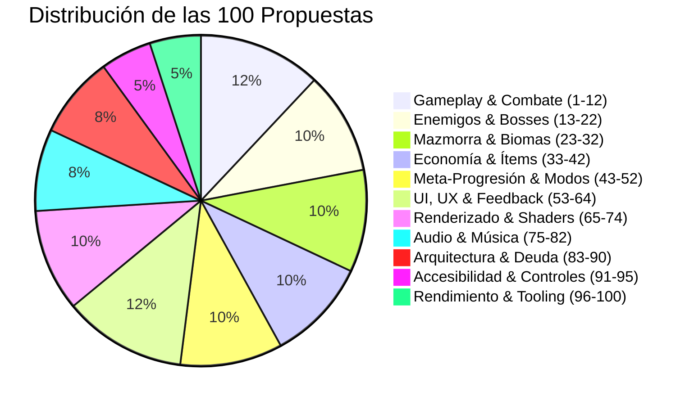

# Las 100 Propuestas para Revisión — Snake Dungeon Crawler

**Fecha de compilación**: 2026-09-18  
**Proyecto**: Snake Love2D — Dungeon Crawler  
**Estado**: Documento integral de planificación y backlog extendido  

---

## 1. Resumen Ejecutivo y Distribución

Este documento recopila, consolida y categoriza las **100 propuestas de mejora y adición** para la evolución del juego en todos sus aspectos técnicos, jugables, visuales y arquitectónicos.

### Clasificación por Prioridad
- **Alta (37 ítems)**: Deuda técnica crítica (splits de monolitos >500L, saneamiento de mocks), legibilidad de combate (ghost frames, causa de muerte, telegrafiado), contenido troncal (árbol del santuario, templates de salas) y soporte nativo de mandos.
- **Media (47 ítems)**: Expansión de variedad, modos alternativos (Boss Rush, Endless, Pacifista), pulido audiovisual (sombras arrojadas 2D, iluminación dinámica, capas musicales reactivas).
- **Baja (16 ítems)**: Micro-animaciones estéticas, sutilezas sensoriales secundarias y modos de nicho.

---

## 2. Tabla Maestra de las 100 Propuestas

| # | Aspecto | Propuesta | Tipo | Descripción & Justificación Técnica / Jugable | Módulos Clave | Prioridad |
|:---:|---|---|:---:|---|---|:---:|
| **1** | Gameplay & Combate | **Ghost Frame con Indicador Radial** | Mejora | Incorporar un reloj radial visible sobre la cabeza de la serpiente tras revivir (`DEATH_ANIMATION`) o usar Autotomía/Reverse Slither para leer con exactitud los 3.0s de intangibilidad restantes. | `entities/snake.lua`, `render/renderMain.lua` | **Alta** |
| **2** | Gameplay & Combate | **Previsualizador de Autotomía (`Q`)** | Nueva | Dibujar una línea punteada sutil hacia la celda donde quedará el señuelo de cola antes de soltar la tecla, evitando desprendimientos accidentales en fosos o trampas. | `entities/snake/abilities.lua`, `render/renderMain.lua` | **Media** |
| **3** | Gameplay & Combate | **Input Buffer Ramp-Up ($0.03\text{s}$)** | Mejora | En `entities/snake/movement.lua`, filtrar micro-pulsaciones parásitas de $<0.03\text{s}$ en giros cerrados para evitar cambios de rumbo involuntarios en teclados de alta tasa de sondeo. | `entities/snake/movement.lua`, `core/input.lua` | **Alta** |
| **4** | Gameplay & Combate | **AABB Pre-Filter en Constrictor Loop** | Mejora | Pre-filtrar por caja delimitadora (AABB) antes de ejecutar el algoritmo de Ray Casting poligonal, reduciendo el coste computacional cuando la cola supera los 20 segmentos. | `entities/snake/collisions.lua` | **Alta** |
| **5** | Gameplay & Combate | **Highlight de Lazo Cerrado** | Nueva | Resaltar con un pulso de luz cian/dorado el polígono encerrado en el mismo instante en que la cabeza toca la cola, anticipando la onda destructora. | `entities/snake/collisions.lua`, `render/particles.lua` | **Media** |
| **6** | Gameplay & Combate | **Distinción Visual de Capas Defensivas** | Mejora | Representar con halos cromáticos diferenciados las protecciones (Escudo = cian eléctrico, Armadura = cobalto sólido, Ghost = blanco traslúcido) para lectura inmediata. | `render/renderMain.lua`, `ui/hudUI.lua` | **Media** |
| **7** | Gameplay & Combate | **Campana de Última Defensa** | Nueva | Emitir un golpe de campana sordo y un flash perimetral rojo en el frame exacto en que se rompe la última capa defensiva, advirtiendo vulnerabilidad letal. | `systems/gamestates/playing.lua`, `audio/sound.lua` | **Alta** |
| **8** | Gameplay & Combate | **Comida Canguro (Jumping Food)** | Nueva | Fruta especial que salta a una celda libre contigua cuando la cabeza entra en radio 1; otorga recompensa superior (+50 pts / +5$) si se embosca en una esquina. | `entities/food.lua`, `systems/gamestates/playing.lua` | **Baja** |
| **9** | Gameplay & Combate | **Comida Mimic Sorpresa** | Nueva | Fruta con probabilidad del 2% de ser un enemigo camuflado; al intentar consumirla se desenmascara y libera un cazador veloz o detona una micro-onda. | `entities/food.lua`, `entities/enemies.lua` | **Media** |
| **10** | Gameplay & Combate | **Frutas Especiales Autóctonas por Bioma** | Nueva | Frutas exclusivas por región: *Mora de Escarcha* en Cripta Helada (congelación zonal), *Guindilla Magmática* en Caverna Volcánica (inmunidad a quemaduras), etc. | `entities/food.lua`, `world/biomeHazards.lua` | **Media** |
| **11** | Gameplay & Combate | **Metrónomo Táctico de Grid** | Mejora | Indicador rítmico opcional en el HUD que pulsa sincronizado con el `moveInterval` para ayudar al jugador a dominar el tempo del modo sostenido (*Held-Key*). | `ui/hudUI.lua`, `entities/snake/movement.lua` | **Baja** |
| **12** | Gameplay & Combate | **Frenado Progresivo en Celdas de Baba** | Mejora | Modificar la deceleración en charcos de baba ácida para que la reducción del 20% en velocidad sea interpolada suavemente en lugar de un salto rígido. | `entities/snake/movement.lua`, `world/biomeHazards.lua` | **Media** |
| **13** | Enemigos & Bosses | **Líneas de Visión Tenues en Chasers** | Nueva | Dibujar conos de visión translúcidos orientados hacia el objetivo de cada cazador, clarificando visualmente los roles *Hunter* y *Flanker*. | `render/enemiesDraw.lua`, `entities/chaserAI.lua` | **Media** |
| **14** | Enemigos & Bosses | **Wyrm Volcánico Segmentado (6 HP)** | Mejora | Rediseñar el mini-jefe Sierpe de Magma para que conste de 6 segmentos vulnerables e independientes, destruibles uno a uno mediante cabezazos tácticos. | `entities/enemyMiniBoss.lua`, `systems/combatRam.lua` | **Alta** |
| **15** | Enemigos & Bosses | **Red Pegajosa de Reina del Enjambre** | Mejora | Hacer que el ataque especial de la Brood Queen cree telarañas que restrinjan los giros en 90° durante 2 segundos, en lugar de generar un charco de slime genérico. | `entities/enemyMiniBoss.lua`, `entities/snake/movement.lua` | **Media** |
| **16** | Enemigos & Bosses | **Patrulleros con Rastro de Ruta Proyectada** | Nueva | Proyectar micro-nodos luminosos tenues 3 celdas por delante de la ruta de patrullaje para anticipar visualmente su embestida supersónica. | `render/enemiesDraw.lua`, `entities/patrollerAI.lua` | **Media** |
| **17** | Enemigos & Bosses | **Enemigo Parásito de Cola** | Nueva | Micro-dron volador que se acopla a la cola aumentando el peso y ralentizando el movimiento; se desprende mediante un giro cerrado *Tail Snap* o lazo. | `entities/enemies.lua`, `entities/snake/abilities.lua` | **Baja** |
| **18** | Enemigos & Bosses | **Spawner en Constelación** | Nueva | Variante de spawner que crea obstáculos en patrones geométricos sincronizados (diamantes, murallas en L o aspas) en lugar de celdas aleatorias adyacentes. | `entities/enemySpawnLogic.lua`, `entities/obstacles.lua` | **Media** |
| **19** | Enemigos & Bosses | **Arena Dinámica de Jefe Final** | Nueva | Cada 15s durante la pelea contra el Boss, una hilera perimetral de losetas se sobrecalienta y electrifica, forzando a reubicar el combate en el centro. | `entities/enemyBossLogic.lua`, `world/biomeHazards.lua` | **Alta** |
| **20** | Enemigos & Bosses | **Boss Alternativo en Etapa 3** | Nueva | Introducir una probabilidad de enfrentarse a un combate dual coordinado de dos mini-jefes de etapa en lugar de la arena estándar. | `world/dungeonGen.lua`, `entities/enemyMiniBoss.lua` | **Media** |
| **21** | Enemigos & Bosses | **Animación de Anticipación de Salto en Minis** | Mejora | Añadir micro-animación de compresión (squash) de 0.3s antes de que Triturador o Gólem ejecuten sus embestidas pesadas. | `render/enemiesDraw.lua`, `entities/enemyMiniBoss.lua` | **Media** |
| **22** | Enemigos & Bosses | **Orbe Central Pulsante en Spawners** | Mejora | Hacer que el núcleo cristalino de los generadores estáticos incremente su velocidad de respiración lumínica conforme se aproxima la expulsión del obstáculo. | `render/enemiesDraw.lua`, `entities/enemySpawnLogic.lua` | **Baja** |
| **23** | Mazmorra & Biomas | **Templates Cruz, Espiral y Laberinto** | Nueva | Incorporar en `dungeonGen.lua` 3 plantillas arquitectónicas complejas que rompan la uniformidad de las 7 salas rectangulares base. | `world/dungeonGen.lua` | **Alta** |
| **24** | Mazmorra & Biomas | **Cofres de Tributo (Ruleta de 3)** | Nueva | Sala especial con 3 cofres cerrados: 1 es una trampa que despierta 3 cazadores rabiosos y los otros 2 entregan reliquias legendarias y oro. | `systems/mystery.lua`, `world/populate.lua` | **Media** |
| **25** | Mazmorra & Biomas | **Muros Vivos Regenerantes** | Nueva | Obstáculos de piedra agrietada que se desintegran al impacto pero se regeneran tras 8 segundos, obligando a recalcular rutas continuamente. | `entities/obstacles.lua`, `world/biomeHazards.lua` | **Baja** |
| **26** | Mazmorra & Biomas | **Interruptores de Presión para Salas Secretas** | Nueva | Baldosa oculta que, al ser cubierta por el cuerpo de la serpiente durante 1 segundo, retrae una sección de pared revelando una cámara de tesoros. | `world/biomeHazards.lua`, `world/world.lua` | **Media** |
| **27** | Mazmorra & Biomas | **Muros Reflectores en Void Sanctuary** | Nueva | En la Etapa 5, permitir que los proyectiles de los enemigos y del Boss reboten con ángulo especular en los monolitos de vacío. | `entities/enemyAttackRegistry.lua`, `world/biomeHazards.lua` | **Media** |
| **28** | Mazmorra & Biomas | **Salidas Duales de Sala** | Nueva | Al cumplir el objetivo, abrir dos compuertas alternativas: una conduce a una ruta con mayor densidad de oro y otra hacia un desafío élite con reliquia. | `systems/gameflow.lua`, `world/world.lua` | **Alta** |
| **29** | Mazmorra & Biomas | **Hundimiento Háptico de Pinchos de Presión** | Mejora | En `biomeHazards.lua`, animar el descenso visual de losetas de pinchos durante la fase de recarga para ofrecer aviso visual intuitivo. | `world/biomeHazards.lua` | **Media** |
| **30** | Mazmorra & Biomas | **Salas Élite de Respiro por Oleadas** | Nueva | Salas de desafío con 3 oleadas de enemigos separadas por un respiro de 2.0s donde se limpian proyectiles activos. | `world/populate.lua`, `systems/gamestates/playing.lua` | **Media** |
| **31** | Mazmorra & Biomas | **Niebla de Visión Dinámica en Túnel** | Mejora | Reemplazar el recorte circular tosco del mutador *Visión de Túnel* por una máscara con gradiente alfa radial suave y penumbra progresiva. | `render/renderMain.lua`, `systems/roomMutators.lua` | **Baja** |
| **32** | Mazmorra & Biomas | **Decoración Orgánica Dinámica por Bioma** | Nueva | Generar pequeñas telarañas en esquinas de catacumbas, vapor en alcantarillas y micro-estalactitas en cavernas sin colisión física. | `render/renderMain.lua`, `world/dungeonGen.lua` | **Baja** |
| **33** | Economía & Ítems | **Tooltips Dinámicos con Sinergias en Tienda** | Nueva | Desplegar un panel explicativo flotante al posar el cursor sobre un ítem en venta, detallando efectos y sinergias con el inventario actual. | `systems/shopDraw.lua`, `systems/items.lua` | **Alta** |
| **34** | Economía & Ítems | **Curva de Inflación y Descuentos en Tienda** | Mejora | Ajustar la economía para aplicar rebajas (-25%) si el jugador llega con racha impecable o ligeros sobrecostos si se abusa de pociones básicas. | `systems/shop.lua` | **Media** |
| **35** | Economía & Ítems | **Animación de Monedas Voladoras al Comprar** | Nueva | Emitir partículas doradas parabólicas que vuelan desde el HUD hasta el vendedor al confirmar una adquisición. | `systems/shopDraw.lua`, `render/particles.lua` | **Media** |
| **36** | Economía & Ítems | **Ítem Activo: Péndulo del Tiempo** | Nueva | Ítem de slot de inventario que detiene enemigos y proyectiles durante 2.0s mientras la serpiente mantiene velocidad completa. | `systems/items.lua`, `systems/player.lua` | **Media** |
| **37** | Economía & Ítems | **Ítem Pasivo: Ojo de Basilisco** | Nueva | Ralentiza en un 40% a todo enemigo que se encuentre en una línea frontal directa de hasta 4 casillas frente a la cabeza. | `systems/items.lua`, `entities/enemies.lua` | **Media** |
| **38** | Economía & Ítems | **Ítem Pasivo: Piel de Adamantio** | Nueva | Concede 1.0 segundo adicional de invulnerabilidad dorada inmediatamente después de que el escudo de energía se fracture por un impacto. | `systems/items.lua`, `systems/combatRam.lua` | **Alta** |
| **39** | Economía & Ítems | **Reroll Especial en Tienda con Token** | Nueva | Objeto consumible que concede una renovación garantizada de catálogo con al menos un ítem de categoría legendaria (Tier S). | `systems/shop.lua`, `systems/items.lua` | **Baja** |
| **40** | Economía & Ítems | **Sinergia Especial: Lazo Explosivo** | Nueva | Al equipar simultáneamente la Baya Constrictora y la Bomba, los lazos cerrados detonan una línea de micro-explosiones perimetrales. | `entities/snake/collisions.lua`, `systems/player.lua` | **Media** |
| **41** | Economía & Ítems | **Stats de Inversión Financiera en Perfil** | Nueva | Registrar en la persistencia del perfil las monedas totales invertidas en cada ítem y su índice de retorno en puntuación. | `systems/persistence.lua`, `systems/profiles.lua` | **Baja** |
| **42** | Economía & Ítems | **Comida-Llave de Bóveda** | Nueva | Fruto dorado místico que solo se engendra con combo $\ge x3$; al comerlo abre la esclusa hacia una bóveda con 3 cofres dorados. | `entities/food.lua`, `world/world.lua` | **Media** |
| **43** | Meta-Progresión & Modos | **Árbol de Talentos del Santuario (Shrine UI)** | Nueva | Pantalla en el Menú Principal para desbloquear los 8 talentos permanentes de 3 rangos (Herencia, Estómago de Dragón, etc.) gastando oro acumulado. | `ui/menuUI.lua`, `systems/persistence.lua` | **Alta** |
| **44** | Meta-Progresión & Modos | **Mazmorra Diaria con Semilla Determinista** | Nueva | Desafío diario sincronizado por fecha (`YYYYMMDD`) con un único intento por perfil y tabla de récords local competitiva. | `systems/gameflow.lua`, `systems/persistence.lua` | **Alta** |
| **45** | Meta-Progresión & Modos | **Códice de la Serpiente y Bestiario 3D** | Nueva | Álbum de lore interactivo que exhibe modelos pixel art animados de enemigos y mini-jefes derrotados junto a sus estadísticas de combate. | `ui/ui.lua`, `systems/profiles.lua` | **Media** |
| **46** | Meta-Progresión & Modos | **Tablón de Cazarrecompensas (Bounties)** | Nueva | Sistema de misiones secundarias activas por expedición con premios sustanciales en monedas al cumplir hazañas tácticas. | `systems/achievements.lua`, `ui/hudUI.lua` | **Alta** |
| **47** | Meta-Progresión & Modos | **Modo de Juego: Boss Rush** | Nueva | Modalidad desbloqueable donde se combaten en sucesión directa los 5 mini-jefes y el Boss final con visitas intermedias a la tienda. | `systems/gameflow.lua`, `world/world.lua` | **Alta** |
| **48** | Meta-Progresión & Modos | **Modo de Juego: Pacifista Táctico** | Nueva | Modo donde las colisiones de cabezazo y las armas ofensivas están selladas; el avance depende de agotar temporizadores y evasión pura. | `systems/gamestates/playing.lua`, `entities/snake.lua` | **Media** |
| **49** | Meta-Progresión & Modos | **Modo de Juego: Abismo Sin Fin (Endless)** | Nueva | Partida infinita con dificultad matemática continuamente escalada, densidad creciente de enemigos y acumulación de mutadores. | `world/dungeonGen.lua`, `systems/gameflow.lua` | **Alta** |
| **50** | Meta-Progresión & Modos | **Catálogo de Skins de la Serpiente** | Nueva | Colección de aspectos estéticos para la serpiente (Neón cibernético, Dragón de magma, Cobra dorada) desbloqueables mediante logros. | `entities/snake.lua`, `systems/persistence.lua` | **Media** |
| **51** | Meta-Progresión & Modos | **Nivel de Prestigio de Perfil** | Nueva | Al culminar la Etapa 5 al 100%, desbloquear la opción de Prestigio: reinicia logros y desbloquea cosméticos de estatus y mutadores duros. | `systems/profiles.lua`, `systems/persistence.lua` | **Baja** |
| **52** | Meta-Progresión & Modos | **Historial Detallado de Últimas 20 Runs** | Nueva | Pantalla que recopila las últimas 20 partidas detallando causa de muerte, duración, combo récord y exportación a JSON o PNG. | `systems/profilesDraw.lua`, `systems/persistence.lua` | **Media** |
| **53** | UI, UX & Feedback | **Causa de Muerte Explícita en Modal** | Mejora | En el modal interactivo de muerte, presentar el icono y nombre exacto de la entidad letal causante del impacto fatal ("Muerte por: Proyectil Boss"). | `systems/gamestates/death.lua`, `ui/popupsUI.lua` | **Alta** |
| **54** | UI, UX & Feedback | **HUD de Defensas por Segmentos Rotos** | Mejora | Sustituir las etiquetas de texto de protecciones en `hudUI.lua` por placas o gemas que se agrietan y rompen con micro-animaciones dinámicas. | `ui/hudUI.lua` | **Media** |
| **55** | UI, UX & Feedback | **Indicador de Amenaza en Bordes de Pantalla** | Nueva | Mostrar pequeños chevrons pulsantes en el marco exterior de la pantalla cuando un proyectil o Patroller se aproxima velozmente fuera del foco. | `ui/hudUI.lua`, `render/renderMain.lua` | **Alta** |
| **56** | UI, UX & Feedback | **Contador de Combo con Shake Dinámico** | Mejora | Incrementar el tamaño tipográfico de `COMBO xN` y aplicar oscilación senoidal proporcional a la magnitud del multiplicador activo. | `ui/hudUI.lua` | **Media** |
| **57** | UI, UX & Feedback | **Score Popups con Trayectoria Parabólica** | Mejora | Hacer que los números flotantes `+100` y `+1$` salten en un arco parabólico con desaceleración elástica antes de desvanecerse. | `ui/hudUI.lua`, `render/renderMain.lua` | **Media** |
| **58** | UI, UX & Feedback | **Cursor de Ratón Personalizado Reactivo** | Nueva | Puntero pixel art temático que cambia de aspecto y genera un destello cian al sobrevolar elementos interactivos de tienda y menús. | `ui/ui.lua`, `core/input.lua` | **Baja** |
| **59** | UI, UX & Feedback | **Barra de Vida de Boss Segmentada en Gemas** | Mejora | Subdividir la barra de salud del Boss en 12 cristales individuales que estallan con chispas de partículas al recibir daño por cabezazos. | `ui/hudUI.lua`, `render/enemiesDraw.lua` | **Media** |
| **60** | UI, UX & Feedback | **Minimapa con Iconografía Diferenciada** | Mejora | Asignar glifos pixel art exclusivos en el minimapa para distinguir salas Élite, Tiendas, Cámaras de Misterio y Salas del Boss. | `ui/overlaysUI.lua` | **Media** |
| **61** | UI, UX & Feedback | **Feedback de Near-Miss (Esquiva al Límite)** | Nueva | Micro-ralentización imperceptible de 2 frames ($0.03\text{s}$) y emisión de chispas blancas cuando la cabeza esquiva un rayo a 1 celda de distancia. | `systems/gamestates/playing.lua`, `render/particles.lua` | **Media** |
| **62** | UI, UX & Feedback | **Toasts con Despliegue de Pergamino** | Mejora | Modernizar el cuadro rectangular de notificaciones para que se desenrolle como un pergamino o terminal de telemetría cyberpunk. | `ui/toastsUI.lua` | **Baja** |
| **63** | UI, UX & Feedback | **Reloj de Racha de Supervivencia en HUD** | Nueva | Reloj circular decreciente o medidor de flama en el HUD que indique el avance hacia el siguiente nivel del multiplicador de supervivencia. | `ui/hudUI.lua` | **Media** |
| **64** | UI, UX & Feedback | **Transición de Sala por Dither Wipe** | Mejora | Sustituir el fade negro tradicional entre salas por un patrón de disolución progresiva en damero pixelado estilo Game Boy / arcade clásico. | `render/renderMain.lua`, `render/shaders.lua` | **Baja** |
| **65** | Renderizado & Shaders | **Foco Cónico Frontal en la Cabeza** | Nueva | La cabeza de la serpiente proyecta un haz de iluminación cónico suave que descubre baldosas y genera sombras dinámicas en muros. | `render/renderMain.lua`, `render/shaders.lua` | **Alta** |
| **66** | Renderizado & Shaders | **Sombras Arrojadas 2D (Drop Shadows a 45°)** | Nueva | Proyectar sombras semitransparentes en diagonal bajo la serpiente, enemigos y rocas para separar nítidamente los planos visuales. | `render/renderMain.lua` | **Alta** |
| **67** | Renderizado & Shaders | **Bloom Selectivo con Threshold (>0.8)** | Mejora | En `shaders.lua`, filtrar el pase de bloom para restringir el glow exclusivamente a fuentes de emisión intensa (láseres, ojos de Chasers, gemas). | `render/shaders.lua` | **Alta** |
| **68** | Renderizado & Shaders | **Shader de Fractura Voronoi en Game Over** | Mejora | Activar la textura Voronoi implementada en P15 para hacer que la pantalla de juego se resquebraje como vidrio templado al morir. | `render/shaders.lua`, `systems/gamestates/death.lua` | **Media** |
| **69** | Renderizado & Shaders | **Reflejos Especulares en FBO Half-Res** | Mejora | Conectar el canvas auxiliar a mitad de resolución para dibujar reflejos difusos de la serpiente y proyectiles sobre baldosas de hielo y agua. | `render/shaders.lua`, `world/biomeHazards.lua` | **Media** |
| **70** | Renderizado & Shaders | **Oclusión Ambiental en Vértices de Paredes** | Nueva | Sombreado de contacto oscuro de 2px en las uniones ortogonales de muros para otorgar volumen de mazmorra pesada. | `world/dungeonGen.lua`, `render/renderMain.lua` | **Baja** |
| **71** | Renderizado & Shaders | **Aberración Cromática Dinámica en Shake** | Mejora | Desfasar de forma proporcional los canales RGB en los bordes de pantalla durante sacudidas intensas causadas por cabezazos al Boss. | `render/shaders.lua` | **Media** |
| **72** | Renderizado & Shaders | **Micro-Animación de Squish & Stretch en Serpiente** | Mejora | Estirar 1.1x el sprite de la cabeza al acelerar e inflarlo elásticamente 0.9x al frenar en modo táctico sostenido. | `entities/snake.lua` | **Media** |
| **73** | Renderizado & Shaders | **Bulto de Digestión Visible (Swallowing Bulge)** | Nueva | Al tragar una fruta, renderizar una pequeña dilatación ondulante que viaja vértebra a vértebra a lo largo del cuerpo hasta la cola. | `entities/snake.lua`, `render/renderMain.lua` | **Baja** |
| **74** | Renderizado & Shaders | **Distorsión Térmica en Lava (Heat Haze)** | Mejora | Confinar el shader de distorsión por calor estrictamente a la superficie de los charcos de magma en la Caverna Volcánica. | `render/shaders.lua`, `world/biomeHazards.lua` | **Baja** |
| **75** | Audio & Música | **Capas Musicales Reactivas (Stems Dinámicos)** | Mejora | Fragmentar la banda sonora en capas instrumentales (percusión, bajo, sintetizador solista) que se encienden según el combo y tensión de la sala. | `audio/sound.lua` | **Alta** |
| **76** | Audio & Música | **Pitch Escalonado Progresivo en Combo** | Mejora | Modificar gradualmente el tono del SFX de comida (`pitch = 1.0 + combo * 0.05`) para conformar una escala musical ascendente con cada fruto ingerido. | `audio/sound.lua`, `systems/gamestates/playing.lua` | **Media** |
| **77** | Audio & Música | **Acorde Armónico en Muertes de Constrictor** | Nueva | Al aplastar múltiples enemigos en un lazo, disparar notas simultáneas que compongan un acorde armónico triunfal proporcional a la cifra atrapada. | `audio/sound.lua`, `entities/snake/collisions.lua` | **Media** |
| **78** | Audio & Música | **Puntero Sonoro Estéreo para Comida (Audio Cue)** | Nueva | Función de accesibilidad auditiva que emite pulsos sonoros estereofónicos que orientan al jugador hacia la fruta más próxima. | `audio/sound.lua`, `entities/food.lua` | **Baja** |
| **79** | Audio & Música | **Feedback Sonoro Diferenciado por Sala** | Nueva | Distinguir el sonido de victoria al desbloquear las puertas de sala según si el reto superado fue Normal, Élite o Cámara de Tesoro. | `audio/sound.lua`, `world/world.lua` | **Media** |
| **80** | Audio & Música | **Filtro Paso-Bajo (Low-Pass) al Pausar** | Mejora | Atenuar frecuencias agudas mediante filtro de audio durante los estados de pausa (`PAUSED`) o apertura de la pantalla de configuración. | `audio/sound.lua` | **Baja** |
| **81** | Audio & Música | **Reverberación Acústica por Bioma** | Nueva | Modular dinámicamente los parámetros de reverberación de OpenAL para distinguir la acústica seca de las catacumbas frente al eco del vacío. | `audio/sound.lua`, `world/world.lua` | **Baja** |
| **82** | Audio & Música | **SFX Exclusivo de Bloqueo de Armadura vs Escudo** | Mejora | Diferenciar sonoramente el impacto metálico seco y pesado de la armadura frente a la fractura brillante y cristalina del escudo de energía. | `audio/sound.lua`, `systems/player.lua` | **Media** |
| **83** | Arquitectura & Deuda | **División de Módulo Monolítico: `playing.lua` (999L)** | Refactor | Descomponer `playing.lua` en submódulos de responsabilidad única: `playingCombat.lua`, `playingPickups.lua` y `playingTriggers.lua` (<400L c/u). | `systems/gamestates/playing.lua` | **Alta** |
| **84** | Arquitectura & Deuda | **División de Módulo: `persistence.lua` (862L)** | Refactor | Separar `persistence.lua` en gestor de datos de perfil (`profileStorage.lua`) y gestor de configuración del sistema (`settingsStorage.lua`). | `systems/persistence.lua` | **Alta** |
| **85** | Arquitectura & Deuda | **División de Módulo: `settingsDraw.lua` (647L)** | Refactor | Reorganizar el dibujado de configuración en pestañas desacopladas (`settingsAudio.lua`, `settingsVideo.lua`, `settingsControls.lua`). | `systems/settingsDraw.lua` | **Media** |
| **86** | Arquitectura & Deuda | **Migración Final de Variables Globales a `World.state`** | Refactor | Enrutar las variables globales remanentes en `main.lua` (`debugImmune`, `transitionTarget`, `fadeAlpha`) al modelo unificado `World.state`. | `main.lua`, `core/world.lua` | **Alta** |
| **87** | Arquitectura & Deuda | **Contrato de API e Interfaz Tipada por Módulo** | Mejora | Introducir anotaciones EmmyLua/LuaLS en todas las funciones públicas de los 65 módulos del motor para validación estricta de tipos. | Todos los módulos en `core/`, `entities/`, etc. | **Media** |
| **88** | Arquitectura & Deuda | **Consolidación del Sistema de Eventos (`core/events.lua`)** | Mejora | Reemplazar dependencias directas entre módulos de juego por emisión y suscripción de eventos (`ROOM_ENTERED`, `HAZARD_HIT`, etc.). | `core/events.lua`, `systems/gamestates.lua` | **Alta** |
| **89** | Arquitectura & Deuda | **Gestor de Entidades Tipo ECS Liviano** | Refactor | Centralizar colecciones separadas de obstáculos, proyectiles y trampas en una lista unificada de entidades con componentes iterables. | `entities/`, `world/` | **Media** |
| **90** | Arquitectura & Deuda | **Saneamiento de Mocks Pre-existentes en Tests** | Refactor | Resolver los 20 tests unitarios heredados que fallan debido a estructuras de datos desactualizadas en el arnés de simulación VFS. | `tests/test_systems.lua`, `tests/test_harness.lua` | **Alta** |
| **91** | Accesibilidad & Controles | **Integración Nativa de Gamepad & Thumbsticks** | Nueva | Implementar mapeo nativo para mandos (Xbox / DualSense / Switch Pro) con calibración de zonas muertas y soporte completo de D-pad en menús. | `core/input.lua`, `systems/settings.lua` | **Alta** |
| **92** | Accesibilidad & Controles | **Soporte de Vibración Háptica (Rumble)** | Nueva | Conectar la API de vibración de mandos en Love2D para retroalimentar cabezazos al Boss, explosiones y fracturas de defensas. | `core/input.lua`, `systems/combatRam.lua` | **Media** |
| **93** | Accesibilidad & Controles | **Paletas de Daltonismo (Protanopia, Deuteranopia, Tritanopia)** | Nueva | Integrar un shader o paletas cromáticas accesibles seleccionables en Ajustes para diferenciar nítidamente a Chasers y Patrollers. | `render/shaders.lua`, `systems/settings.lua` | **Alta** |
| **94** | Accesibilidad & Controles | **Interruptor Maestro de Reducción de Movimiento** | Nueva | Conmutador global en Ajustes que desactive al unísono sacudidas de pantalla, distorsiones de calor, parpadeos y destellos intensos. | `systems/settings.lua`, `render/renderMain.lua` | **Alta** |
| **95** | Accesibilidad & Controles | **Reasignación Completa de Teclas (Custom Keybinds)** | Nueva | Interfaz interactiva en el panel de Ajustes que permita al jugador remapear cualquier tecla de dirección, ítems o habilidades. | `systems/settingsDraw.lua`, `core/input.lua` | **Alta** |
| **96** | Rendimiento & Tooling | **Test Automatizado de Memoria Zero-Allocation (60s)** | Mejora | Diseñar un test unitario headless en `tests/` que simule 3,600 frames verificando que el recolector de basura (`collectgarbage`) reporte Δ0KB. | `tests/smoke.lua`, `main.lua` | **Alta** |
| **97** | Rendimiento & Tooling | **Benchmark y Escena de Estrés en Menú Debug** | Nueva | Opción en la consola Tab para spawnear una escena con 50 Chasers, 100 proyectiles y 20 trampas midiendo el frametime con exactitud. | `systems/debugTools.lua` | **Media** |
| **98** | Rendimiento & Tooling | **Monitor de Rendimiento en HUD (Frame Time / GC Tracker)** | Nueva | Gráfico desplegable minimalista en esquina que trace en tiempo real el tiempo de CPU por frame y la memoria viva de Lua. | `ui/hudUI.lua`, `main.lua` | **Baja** |
| **99** | Rendimiento & Tooling | **Integración Continua con GitHub Actions Headless** | Nueva | Automatizar mediante GitHub Actions la ejecución de `love . --test` en Linux headless en cada Pull Request para evitar regresiones. | `.github/workflows/ci.yml` | **Media** |
| **100** | Rendimiento & Tooling | **Generación de Builds y Empaquetado Multiplataforma** | Nueva | Scripts automatizados para compilar ejecutables autónomos (.exe para Windows, AppImage para Linux y .app para macOS). | `tools/build.sh` | **Media** |

---

## 3. Plan de Acción Recomendado por Fases

Para una ejecución ordenada sin desestabilizar el motor de juego, se sugiere abordar estas propuestas en tres etapas de desarrollo:

### Fase I: Resiliencia Arquitectónica y Saneamiento Inmediato (Propuestas 83, 84, 85, 86, 90, 95, 96)
1. **Desmonolitizar `playing.lua` (999L)** y **`persistence.lua` (862L)** para respetar el límite arquitectónico de $<500$ líneas por archivo.
2. Corregir los 20 tests unitarios con fallos en mocks pre-existentes para dejar el arnés de pruebas al 100% en verde.
3. Incorporar la reasignación de teclas personalizada en Ajustes y el test de cero asignación de memoria a 60 FPS.

### Fase II: Contenido Troncal y Feedback de Combate (Propuestas 1, 3, 4, 7, 14, 19, 23, 28, 33, 43, 46, 53, 55, 65, 66, 67, 91, 93, 94)
1. Implementar el árbol de talentos del **Santuario (Shrine UI)** y el tablón de cazarrecompensas.
2. Incorporar las plantillas de mazmorra complejas (Cruz, Espiral, Laberinto) y salidas duales.
3. Añadir el soporte nativo de mandos con análogos y las opciones de accesibilidad de daltonismo y reducción de movimiento.
4. Mejorar la retroalimentación de combate: causa explícita de muerte, indicadores de peligro perimetral, foco cónico de luz frontal y sombras proyectadas a 45°.

### Fase III: Modos de Juego y Pulido Audiovisual (Propuestas 20, 44, 47, 49, 50, 68, 69, 75, 76, 99, 100)
1. Desbloquear los modos alternativos de juego (**Boss Rush**, **Endless Abyss**, **Mazmorra Diaria**).
2. Habilitar el catálogo de skins y la música adaptativa por stems interactivos.
3. Configurar la integración continua en GitHub Actions y el empaquetador de builds multiplataforma.
